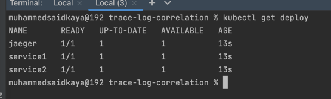
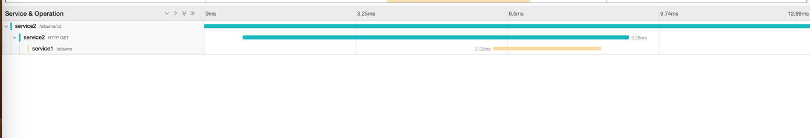
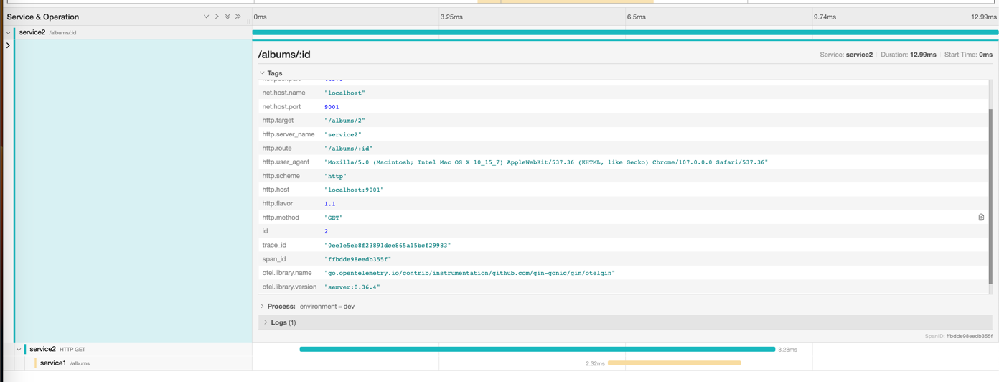
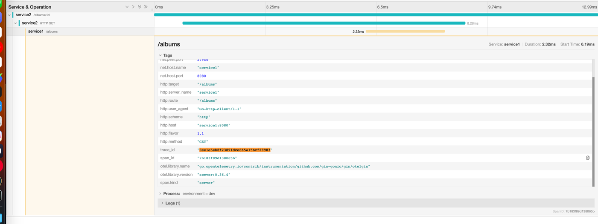

# Trace-Log-Correlation with Opentelemetry

## Used Technologies

* [Docker Desktop](https://www.docker.com/products/docker-desktop/)
* [Go 1.17+](https://go.dev/doc/install)
* Kubectl
* Minikube
* Skaffold
* Opentelemetry-Go
* Jaeger
* Logrus


# Usage

## Installation

```
# Installation just for one time.
./scripts/install.sh
```

* This script installs all requirements for local development: Homebrew, Kubectl, Minikube, and Skaffold.
* Creates a minikube Kubernetes cluster on your local environment.
## Local Development

```
./scripts/run.sh
```

* This script builds and deploy your applications to the Minikube Kubernetes Cluster and for hot reloading skaffold is used. Whenever you change any code block your application will rebuild again and deploy.
* You can verify everything is working properly or not by comparing **kubectl get deploy** command's result with the following screenshoot.



### Usecase Example

```
curl http://localhost:9001/albums/1
# Go to the http://localhost:16686/ for accessing Jaeger UI.
```

#### Flow Diagram

* Service2 - /albums/:id - endpoint
  * OtelGin Middleware for Context Propagation (HTTP Headers Import & Export)
  * Http Client Request 
    * Service1 - /albums - endpoint
      * OtelGin Middleware for Context Propagation (HTTP Headers Import & Export)
      * Returns All Albums which is kept in-memory.
  * Filters Albums By Id
  * Returns a specific Album.

#### Logs

Service1 | Service2

* You can see the trace and span ids are logged.


#### Traces (Jaeger)

* You can see the trace and span ids on Jaeger.






# Resources

* Skaffold
  * https://skaffold.dev/docs/environment/local-cluster/
  * https://webera.blog/kubernetes-development-workflow-with-skaffold-kustomize-and-kind-12d4a72a2cbf
  * https://www.youtube.com/watch?v=Rm5W6Bh9PIE
* Minikube Port Forwarding
  * https://stackoverflow.com/questions/67267610/minikube-running-in-docker-and-port-forwarding
* Opentelemetry-Go Manual Instrumentation
  * https://opentelemetry.io/docs/instrumentation/go/manual/
  * https://github.com/open-telemetry/opentelemetry-go/discussions/2074
  * https://pkg.go.dev/go.opentelemetry.io/contrib/instrumentation/net/http/otelhttp#pkg-overview
  * https://github.com/open-telemetry/opentelemetry-go/tree/main/example/otel-collector