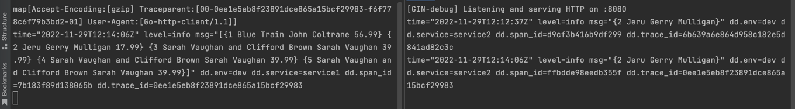
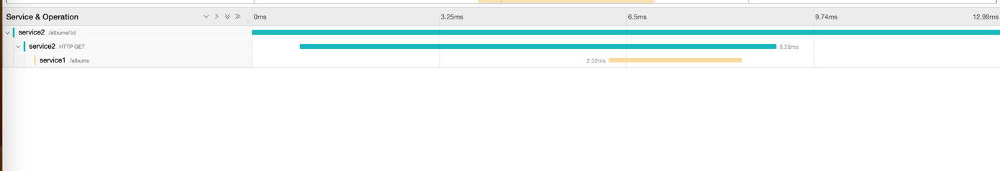
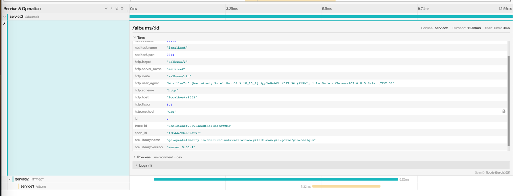
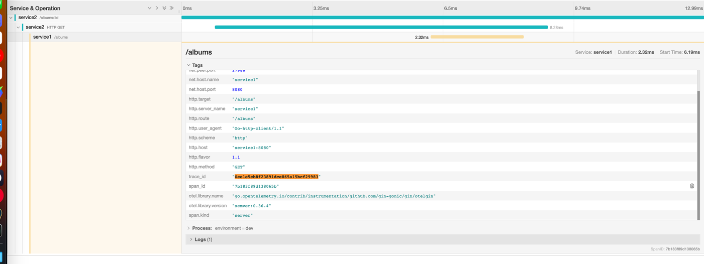

# Trace-Log-Correlation with Opentelemetry

## Used Technologies

* [Docker Desktop](https://www.docker.com/products/docker-desktop/)
* [Go 1.17+](https://go.dev/doc/install)
* Minikube
* Skaffold
* Opentelemetry
* Jaeger


# Usage

```
./install.sh
./run.sh
curl http://localhost:9000/albums
curl http://localhost:9001/albums
curl http://localhost:16686/
```

## Logs


## Traces (Jaeger)





# Resources

* https://skaffold.dev/docs/environment/local-cluster/
* https://webera.blog/kubernetes-development-workflow-with-skaffold-kustomize-and-kind-12d4a72a2cbf
* https://www.youtube.com/watch?v=Rm5W6Bh9PIE
* https://stackoverflow.com/questions/67267610/minikube-running-in-docker-and-port-forwarding
* https://opentelemetry.io/docs/instrumentation/go/manual/
* https://github.com/open-telemetry/opentelemetry-go/discussions/2074
* https://pkg.go.dev/go.opentelemetry.io/contrib/instrumentation/net/http/otelhttp#pkg-overview